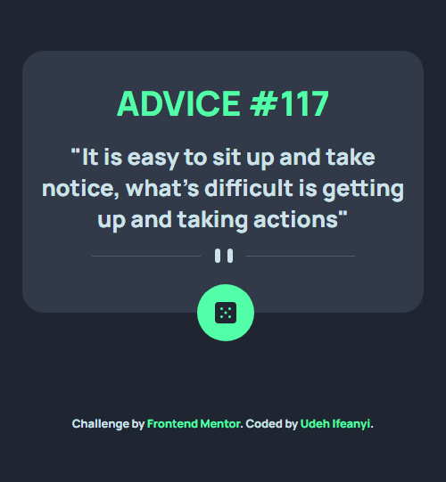

# Frontend Mentor - Advice generator app solution

This is a solution to the [Advice generator app challenge on Frontend Mentor](https://www.frontendmentor.io/challenges/advice-generator-app-QdUG-13db). Frontend Mentor challenges help you improve your coding skills by building realistic projects.

## Table of contents

- [Overview](#overview)
  - [The challenge](#the-challenge)
  - [Screenshot](#screenshot)
  - [Links](#links)
- [My process](#my-process)
  - [Built with](#built-with)
  - [What I learned](#what-i-learned)
- [Author](#author)

## Overview

### The challenge

Users should be able to:

- View the optimal layout for the app depending on their device's screen size
- See hover states for all interactive elements on the page
- Generate a new piece of advice by clicking the dice icon

### Screenshot

### Links

- Solution URL: [https://github.com/Ifescohub/advice-generator](https://github.com/Ifescohub/advice-generator)
- Live Site URL: [https://ifesco-advice-gen.netlify.app/](https://ifesco-advice-gen.netlify.app/)

## My process

### Built with

- Semantic HTML5 markup
- Pure CSS
- Vanilla JavasSript
<<<<<<< HEAD
- API
=======
>>>>>>> 4c72b2e69ef4c4c64fe7f96ccd8e3fa470a7d17b
- Flexbox
- [Google Fonts](https://fonts.googleapis.com/css2?family=Manrope:wght@800&display=swap) - For Fonts

### What I learned

This challenge exposed me to how to use fetch to get data from a URL.

## Author

- GitHub - [Udeh Ifeanyi](https://github.com/Ifescohub)
- Frontend Mentor - [@ifescohub](https://www.frontendmentor.io/profile/Ifescohub)
- Twitter - [@UdehIfeanyi10](https://twitter.com/UdehIfeanyi10)
<<<<<<< HEAD

=======
>>>>>>> 4c72b2e69ef4c4c64fe7f96ccd8e3fa470a7d17b
